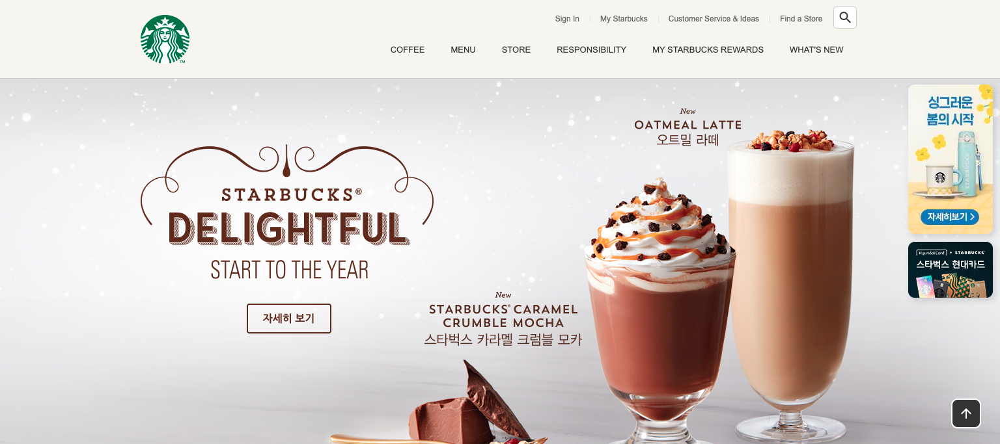
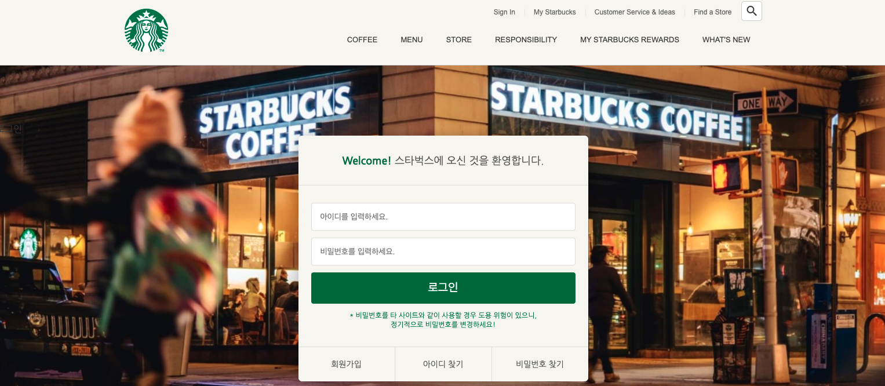
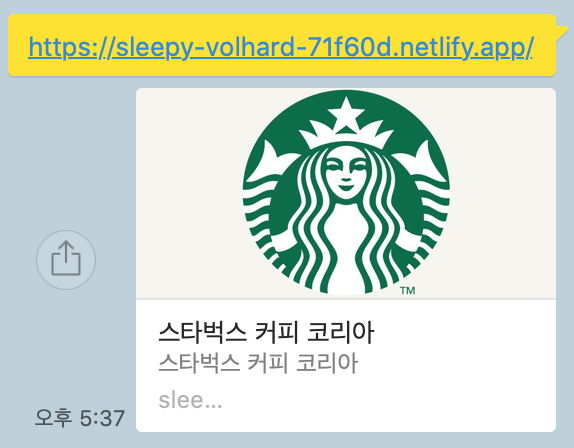
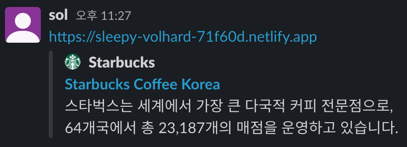

# ☕️ Starbucks

스타벅스 랜딩 페이지 (vanilla script)

🌳 branch:  
[master](https://github.com/sollike/starbucks/tree/master)  
[signin](https://github.com/sollike/starbucks/tree/signin)

[배포 DEMO 👆🏻 확인하기](https://sleepy-volhard-71f60d.netlify.app/)

---

# 🛠 적용한 기술들 APIs

[The Open Graph protocol](https://ogp.me/):  
웹페이지가 소셜 미디어(페이스북 등)로 공유될 때 우선적으로 활용되는 정보를 지정  
[Twitter Cards](https://developer.twitter.com/en/docs/twitter-for-websites/cards/guides/getting-started):  
웹페이지가 소셜 미디어(트위터)로 공유될 때 우선적으로 활용되는 정보를 지정

적용 결과:  

---

---

 

✏️ font : Googlefont-`NanumGothic`  
[lodash](https://cdnjs.com/libraries/lodash.js)
: side badge event를 위해 사용. throttle()로 함수 부하를 조정.

[gsap](https://cdnjs.com/libraries/gsap):  
`gsap.to()`를 사용해 이벤트 요소, 시간, 옵션을 쉽게 처리  
ScrollToPlugin를 사용해 상단으로 이동 버튼 이벤트를 쉽게 처리

📍 sidebadge 스크롤 이벤트 처리
📍 totop 버튼 이벤트 처리

[Swiper](https://swiperjs.com/):  
new Swiper()로 swiper 객체를 생성해 보다 쉽게 슬라이드를 생성하고 처리.  
`direction, autoplay, loop, slidePerView, spaceBetween, Navigation, pagination..`  
여러 변수를 조작할 수 있음.

📍 `photocard` 배너 생성  
📍 `공지사항` 배너 생성  
📍 `awards` 슬라이드 배너

[ScrollMasic](https://cdnjs.com/libraries/ScrollMagic):  
스크롤 범위를 감시  
📍 하단 4개의 section에 스크롤 되어 보여지는 범위에 따라 이벤트를 적용함

[YouTube Player](https://developers.google.com/youtube/iframe_api_reference?hl=ko):  
유튜브 영상 배경 삽입

📍 youtube.js 따로 작성해 영상의 videoID 삽입해 재생
